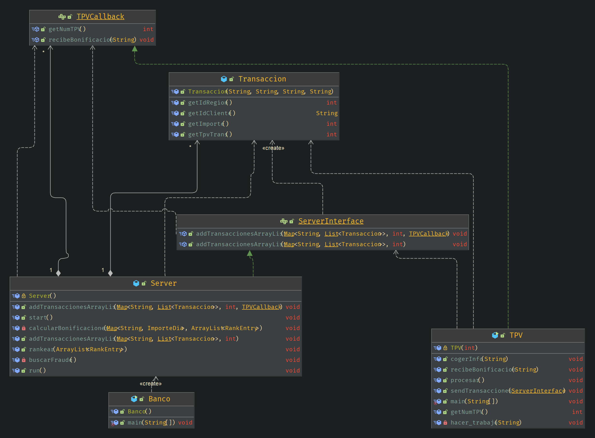

# Instrucciones para ejecutar
## Aclaraciones 
Hemos realizado la parte del proyecto básico y el obligatoria. Cuando ejecute el programa se le preguntará qué opción quiere correr.

## Archivos necesarios
Clone el respositorio usando: \
`git clone ssh://git@middleware.fi.upm.es:1022/21_22_grupo10/PracticaRMI.git`\
Ejecute el sigueinte comando para compilar los archivos siguientes pasos:\
`cd PracticaRMI`
El resto de comandos para su uso se especifican más abajo. Debe tener instalado make y tmux

## Explicación de los componentes
Los componentes java de la practica son: 
- **Banco**:
  - Se crea el registro con el nombre "_bonificaciones_" para que sea encontrado por los TPVs
  - Se crea el servidor, que se pone en marcha en localhost &rarr; con su policy correspondiente en _Banco.policy_
- **Server**:
  - Opera a través de la interfaz remota "_ServerInterface.java_"
  - Implementa toda la lógica dentro del servidor:
    1. Recibe las listas de transacciones de los TPVs les asignan
    2. Asigna las bonificaciones a los clientes
    3. Hace rankings locales
    4. De los rankings locales crea el ranking local
    5. Imprime por pantalla el ranking global
    6. Hace el callback al TPV, mandándole las bonificaciones recibidas por los clientes
- **TPV**: es la componente que representa los Terminales de Pago encargados de leer y enviar las transacciones.
  - Crea tantos objetos TPVs como ficheros haya. Cada TPC
    1. Procesa los archivos y parsea la información &rarr; crea un mapa 
    2. Se conecta al servidor, invoca el método remoto addTransaccionesArrayList
    3. El servidor al recibir la invocación remota añade el cliente a una lista de clientes y añade la lista de transacciones
    4. El server una vez calculadas las bonificaciones manda mediante un método remoto la lista local con las bonificaciones de todos los clientes a cada TPV correspondiente
- **Transacción**: es la clase que representa una transacción, creada a partir de cada línea de los ficheros .txt

##Instrucciones para ejecución
Para interactuar con el progama se usará el mandato make con distintas opciones. Estas son:\
- `make compile` &rarr; compila los archivos .java contenidos en _/src/_ y creando los .class correspondientes que se depositan en la carpeta _/out/_ 
- `make general` &rarr; ejecuta el programa general dentro de una ventana partida de tmux
- `make extra` &rarr; ejecuta el programa extra dentro de una ventana partida de tmux
- `make clean` &rarr; elimina los archivos compilados y el directorio _/out/_ donde residen

## Diagrama de las clases usada e interdependencia

